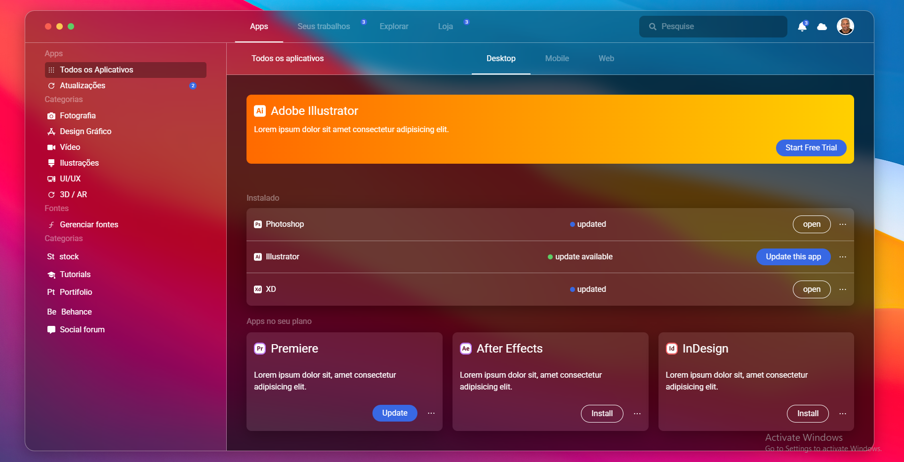

# ✨ Glassmorphism App

Um aplicativo moderno com **design Glassmorphism**, focado em interface limpa, elegante e responsiva.  
O projeto utiliza **React** e conceitos modernos de **UI/UX**, com efeitos de vidro (blur, transparência e gradientes).

---

## 📸 Preview

> Interface com efeito glass, gradientes suaves e layout moderno.

---

## 🚀 Tecnologias Utilizadas

- ⚛️ **React**
- 🎨 **CSS / Tailwind CSS**
- 🌈 **Glassmorphism (backdrop-filter, blur, transparency)**
- 📦 **Vite** 
- 🔥 **React Icons**

---

## 🎯 Funcionalidades

- Layout com **efeito vidro (glassmorphism)**
- Componentes reutilizáveis
- Design responsivo
- Gradientes modernos
- Estrutura organizada de componentes

---
made by: Christophe Guerra ✨